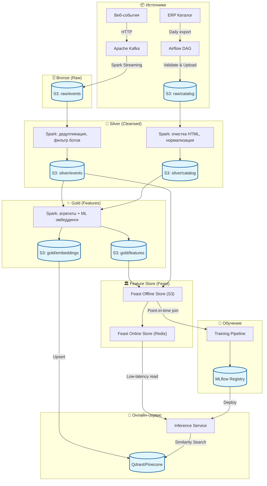

# Проектирование Data Pipeline и интеграционных шлюзов для системы рекомендаций

## 1. Анализ требований и источников данных
**Бизнес-цель:** повышение CTR и конверсии интернет-магазина через персонализированные рекомендации («Похожие товары», «С этим покупают», «Рекомендуем вам»).

**Источники:**
- **Стриминг — поведение пользователей:** события просмотров, кликов, добавлений в корзину и покупок отправляются с веб-сайта в Apache Kafka через HTTP-коллектор. Гарантия доставки at-least-once. Возможны late arrival, дубликаты, бот-трафик.
- **Батч — каталог товаров:** ежедневная выгрузка из ERP в AWS S3 (CSV/Parquet). Содержит `product_id`, название, описание, категории, бренд, цену, признак наличия. Требуется очистка описаний (HTML-теги, опечатки) и нормализация атрибутов.

## 2. Проектирование ELT-пайплайна
Пайплайн следует медальонной архитектуре (Bronze → Silver → Gold). Очистка и генерация эмбеддингов выполняются на слоях Silver и Gold соответственно.

**Этапы:**
1. **Ingestion (Raw / Bronze):** События из Kafka через Spark Streaming записываются в S3 (`raw/events`, Parquet) с партицированием по дате события. ERP отправляет данные через Airflow DAG, который валидирует файл и загружает его в бакет `raw/catalog` .
2. **Очистка и нормализация (Silver):** Отдельные Spark Batch Jobs читают сырые данные: для событий — фильтрация ботов (user-agent, частота), дедубликация по `event_id`; для каталога — очистка HTML, приведение категорий к справочнику, фильтрация некорректных записей. Результат — `silver/events` и `silver/catalog`.
3. **Генерация признаков и эмбеддингов (Gold):** Spark-джобы считают пользовательские и товарные признаки (средний CTR, популярность, аффинити к категориям) за окно 30 дней, а также вычисляют эмбеддинги товаров (Sentence Transformer по тексту описания). Данные сохраняются в `gold/features` и `gold/embeddings`.
4. **Подача в онлайн-сервисы:** User-признаки загружаются в Redis, эмбеддинги — в Vector DB (Pinecone/Qdrant). Инференс-сервис по `user_id` получает профиль из Redis и через векторный поиск находит топ-N похожих товаров.
5. **Обучение моделей:** Обучающая выборка формируется из `silver/events` и `gold/features`. Модель обучается офлайн, артефакт сохраняется в MLflow Model Registry и деплоится в инференс-сервис.

> **Схема архитектуры данных**

## 3. Выбор хранилищ и обоснование

| Слой / Этап | Технология | Обоснование |
|------------|------------|--------------|
| Стриминговый буфер | Apache Kafka | Высокая пропускная способность, replayability |
| Data Lake (Raw/Silver/Gold) | AWS S3 (Parquet) | Дешёвое масштабируемое хранение, интеграция со Spark и Feast |
| Пакетная и потоковая обработка | Apache Spark | Унификация batch/streaming, SQL+ML, работа с S3 и Kafka |
| Feature Store | Feast (Offline: S3, Online: Redis) | Единый реестр, point-in-time join, материализация в онлайн-стор |
| Онлайн-признаки | Redis | In-memory, задержка <1 мс |
| Векторный поиск | Pinecone / Qdrant | Оптимизированный ANN-поиск, фильтрация по метаданным |
| Model Registry | MLflow | Версионирование, управление стадиями (staging/production) |
| Инференс-сервис | FastAPI | Лёгкий, асинхронная интеграция с Redis и Vector DB |

**Роль Feature Store:** Feast хранит определения признаков (Registry), формирует исторические выборки без утечки будущего (point-in-time join) и материализует актуальные значения в Redis. Обучение и инференс используют один SDK, что гарантирует идентичность признаков.

## 4. Обеспечение консистентности данных (Data Governance)
- **Единый реестр признаков:** Feast Registry фиксирует логику трансформаций, используемую в Spark-джобах и при инференсе.
- **Point-in-time корректность:** При построении обучающей выборки Feast объединяет события с признаками на момент `event_timestamp`, предотвращая «утечку будущего».
- **Материализация:** После расчёта признаков Feast переносит их в Redis; инференс получает значения через `get_online_features()`.
- **Мониторинг дрейфа:** Сравнение распределений признаков (PSI) между офлайн- и онлайн-срезами, алерты при расхождении. Валидация качества на каждом слое (Great Expectations).
- **Версионирование:** Признаки и модели версионируются (Git, MLflow), возможен быстрый откат при деградации. Происхождение данных отслеживается в DataHub.

